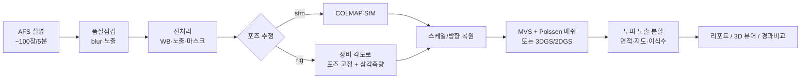

# AFS 촬영 사진 기반 두피·모발 3D 모델 구현 — 개념 설계서 (concept.md)

> 대상: 탈모 진료·모발이식 클리닉에서 AFS 촬영 장비(약 5분간 각도별 100여 장, 밝기 설정 가능)로 얻은 사진 세트
> 목표: 사진 세트 → **실측 스케일(mm)을 가진 3D 두상 모델** → **탈모 면적·이식 계획·경과 비교** 정량 지표
> 현재 상태: `afs3d/` 폴더에 동작하는 프로토타입(파이썬 + COLMAP)과 합성 데이터 검증 포함. 본 문서 9장 참고.

---

## 0. 요약

| 단계 | 핵심 내용 | 산출물 |
|---|---|---|
| ① 촬영 표준화 | 노출·화이트밸런스 고정, 편광 조명, 머리 고정, 스케일 마커 | 촬영 SOP, 매니페스트(CSV) |
| ② 입력·품질점검 | 흔들림/노출 이상 컷 자동 검출·제외 | `quality.csv` |
| ③ 전처리 | 세트 단위 색 보정, 배경 마스크, 해상도 조정 | 정규화 이미지 + 마스크 |
| ④ 카메라 포즈 | SfM(사진만으로 추정) 또는 리그(장비 각도값 고정) | COLMAP sparse 모델 |
| ⑤ 스케일·방향 | 촬영 반경/마커로 mm 스케일, 카메라로 위·앞 방향 | `reconstruction.json` |
| ⑥ 조밀 재구성·메쉬 | MVS → Poisson 메쉬 (또는 3DGS/2DGS) | 색 입힌 PLY 메쉬 |
| ⑦ 임상 분석 | 두피 노출 면적(cm²), 비율, 이식 모낭수 추정, 정수리 지도 | `report.json`, `top_view.png`, `coverage.ply` |
| ⑧ 시각화·기록 | 웹 3D 뷰어(회전·거리 측정), 경과 비교 | `viewer/index.html` |
| ⑨ 검증·연구 | 팬텀/반복측정 신뢰도(ICC, Bland–Altman), IRB | 논문 |



---

## 1. 배경과 목표

### 1.1 왜 3D 인가
- 2D 표준 사진(정면·정수리·측면)은 **투영 왜곡** 때문에 곡면인 두피의 면적을 과소평가하고, 촬영 거리·각도가 매번 달라 경과 비교가 부정확하다.
- 3D 모델은 곡면 위에서 직접 면적(cm²)을 계산할 수 있어 **이식 부위 면적 × 목표 밀도 = 필요 모낭단위(FU)** 계획, **SALT 점수 자동화**(원형탈모), **헤어라인 디자인** 시뮬레이션, **치료 전후 정량 비교**가 가능하다.

### 1.2 1차 목표 (MVP)
1. AFS 사진 세트를 입력하면 30~60분 안에 mm 단위 3D 두상 메쉬를 만든다.
2. 정수리~전두부 두피 노출 면적과 비율을 자동 산출하고, 이식 밀도 가정(예: 30/40/50 FU/cm²)별 필요 모낭수를 추정한다.
3. 결과를 브라우저 3D 뷰어와 정수리 지도(PNG)로 보여준다.

### 1.3 범위 밖 (후속 단계)
- 모발 1가닥 단위 재구성(굵기·밀도 측정)은 트리코스코피(확대 영상) 영역이다. 3D 모델은 **거시적 분포·면적**을 담당하고, 모발 밀도/굵기는 트리코스코피 결과를 3D 지도 위에 **등록(registration)** 하는 방식으로 결합한다(8장).

---

## 2. 입력 데이터(AFS)에 대한 가정과 확인 사항

AFS 장비의 정확한 내보내기 형식은 제조사 확인이 필요하다. 설계는 아래 가정 위에 있으며, **Phase 0 에서 반드시 확인**한다.

| 항목 | 가정 | 확인 방법 / 영향 |
|---|---|---|
| 사진 수·시간 | 100여 장, 약 5분 | 5분은 환자 움직임이 생기기 충분한 시간 → 마스크 필수(5.3) |
| 파일 형식 | JPEG(또는 RAW/PNG) + EXIF | EXIF 초점거리가 있으면 COLMAP 초기값으로 사용 |
| 각도 정보 | 방위각/고도 값을 내보내거나, 촬영 순서가 고정 | 내보내면 `rig` 모드, 없으면 `sfm` 모드 |
| 카메라 수 | 1대 이동식 또는 다중 카메라 | 다중이면 `--multi-camera` |
| 밝기 설정 | 촬영 중 고정 또는 컷별 변경 가능 | 변경 시 설정값을 매니페스트 `exposure` 열로 기록 → 보정에 사용 |
| 촬영 반경 | 머리 중심 ~ 카메라 거리 일정 | SfM 결과의 mm 스케일 복원에 사용(5.5) |
| 배경 | 단색 배경막 | 단색이면 규칙 기반 마스크, 아니면 딥러닝 분할 |

### 매니페스트 CSV (프로그램 입력 규격)
```csv
filename,azimuth_deg,elevation_deg,radius_mm,focal_px,exposure
afs_000.jpg,0,0,450,4200,1.0
afs_001.jpg,10,0,450,4200,1.0
```
- `filename` 만 필수. 나머지는 있을수록 기능이 늘어난다.
- `azimuth_deg`: 0° = 얼굴 정면, 반시계. `elevation_deg`: 0° = 귀 높이 수평, 90° = 정수리 바로 위.
- `exposure`: 상대 노출 배율(선형광 기준). 없으면 EXIF(셔터×ISO/F²)를 쓰고, 그것도 없으면 픽셀 밝기로 맞춘다.

---

## 3. 촬영 프로토콜 표준화 (정확도의 절반은 여기서 결정)

3D 재구성은 "같은 점이 여러 사진에서 같은 모양·색으로 보인다"는 가정에 의존한다. 두피·모발은 이 가정을 깨는 대표적인 대상(반사광, 가는 섬유, 반복 무늬)이므로 촬영 단계 통제가 가장 효과가 크다.

1. **노출·화이트밸런스 수동 고정**: 세션 내 자동노출/자동WB 끄기. 밝기를 바꿔야 한다면 값을 기록.
2. **교차 편광(cross-polarization) 조명**: 광원과 렌즈에 직교 편광 필터 → 두피의 기름·땀 반사광 제거. 반사광은 시점마다 위치가 달라 가짜 특징점과 구멍을 만든다.
3. **균일 확산광**: 링라이트/소프트박스로 그림자 최소화. 각도별로 조명이 같이 움직이지 않는 구조가 유리.
4. **머리 고정**: 턱받침/이마 받침. 5분 동안 수 mm 움직임도 모발 경계 정확도를 떨어뜨린다.
5. **스케일·기준 마커**: 이마 밴드나 귀 위에 크기를 아는 ArUco/원형 마커 스티커(예: 10 mm). ① 스케일 검증 ② 방문 간 정합 ③ 움직임 감지에 쓴다.
6. **겹침**: 인접 컷 간 60~70% 이상 겹침. 정수리 위 고도(60~80°) 링을 반드시 포함 — 탈모 평가의 핵심 부위다.
7. **모발 상태 통일**: 방문마다 같은 상태(건조, 빗질 방향, 스타일링 제품 없음). 경과 비교 시 모발 부피 차이가 면적 차이로 오인될 수 있다.
8. **배경**: 단색 무광 배경막(두피색·모발색과 다른 색, 예: 청록/회청색).
9. **해상도**: 두피 노출부 경계를 보려면 두피 위 0.1~0.2 mm/px 수준 권장(대략 2,000만 화소 이상, 머리가 화면 60% 이상).

---

## 4. 시스템 구성

```
afs3d/
  concept.md            ← 본 문서
  README.md             사용법
  afs3d/
    io_utils.py         이미지/매니페스트 읽기, EXIF 노출·회전 처리
    quality.py          흔들림(Laplacian 분산)·노출·클리핑 점검
    preprocess.py       세트 단위 WB, 노출 정규화, 배경 마스크, 리사이즈(EXIF 보존)
    geometry.py         리그 각도 → 카메라 포즈, 쿼터니언, 구/원 피팅(스케일)
    colmap_io.py        COLMAP 텍스트 모델·DB 입출력
    reconstruct.py      COLMAP 실행(sfm/rig, sparse/dense), 스케일·방향 추정
    ply.py              PLY 메쉬 입출력(의존성 없음)
    analysis.py         두피 노출 분할, 면적·비율·이식수, 정수리 지도
    synthetic.py        정답을 아는 합성 두상 + 100컷 렌더링(검증용)
    cli.py              명령행: check / prep / reconstruct / analyze / run / demo
  viewer/index.html     브라우저 3D 뷰어(드래그&드롭, 회전, 두 점 거리 측정)
  tests/                단위·통합 테스트
```

권장 실행 환경
- 워크스테이션: NVIDIA GPU(VRAM 12 GB 이상, CUDA), RAM 32 GB 이상, 여유 디스크 50 GB.
- 소프트웨어: Python 3.10+, COLMAP 3.9+ (CUDA 빌드 — dense 단계 필수). CPU 만으로는 sparse(포즈)까지만 가능.
- 대략적 처리 시간(100장, 2,400만 화소, GPU 기준, 환경에 따라 크게 달라짐): 특징점·매칭 5~10분, SfM 2~5분, 조밀 재구성·메쉬 15~40분.

---

## 5. 단계별 절차와 방법

### 5.1 품질 점검 (`afs3d check`)
- **흔들림**: 동일 해상도(긴 변 1024 px)로 줄인 뒤 Laplacian 분산 → 세트 중앙값의 40% 미만이면 `blurry`.
- **노출**: 평균 밝기가 중앙값 대비 ±25% 벗어나면 `exposure_outlier`, 밝은 포화 5%↑ `overexposed`, 암부 20%↑ `underexposed`.
- 절대 기준이 아니라 **세트 중앙값 대비 상대 기준**을 쓰는 이유: 각도마다 머리가 차지하는 면적·모발 비율이 달라 절대값이 의미가 없다.
- `--drop-flagged` 로 자동 제외. 100장 중 10장 이하 제외는 재구성에 거의 영향이 없다.

### 5.2 색·노출 정규화 (`afs3d prep`)
- **화이트밸런스는 세트 전체에 하나**: 각 사진의 회색세계 게인의 중앙값을 모든 사진에 동일 적용. 사진별로 따로 맞추면 탈모 부위가 많이 보이는 각도와 모발이 많은 각도의 색이 서로 달라진다.
- **노출은 메타데이터 우선**: 매니페스트 `exposure` 또는 EXIF(셔터×ISO/F²)로 선형광 공간에서 보정. 픽셀 밝기 기반 보정은 "내용 차이(두피가 더 보여 밝음)"까지 지워버리므로 최후 수단.
- 보정은 선형광(감마 2.2 역변환) 공간에서 곱하고 다시 sRGB 로 저장. EXIF(초점거리)는 보존하고 회전 태그는 픽셀에 반영 후 초기화.

### 5.3 배경 마스크
- 5분 촬영 중 **머리는 움직이고 배경은 고정**이면 SfM 이 두 개의 상충하는 강체 운동을 보게 된다 → 배경 특징점을 반드시 제거해야 한다.
- 프로토타입: 가장자리 색(Lab 중앙값)을 배경으로 보고 차이가 큰 가장 큰 연결 영역을 머리로 선택 + 구멍 메우기. 단색 배경에서 IoU > 0.97 (테스트).
- 실사용 확장: 배경이 복잡하면 SAM2 계열 분할 모델 또는 인물 분할 모델로 교체. 어깨·옷도 제외하려면 "머리+목" 클래스만 남긴다.
- COLMAP 규칙: `masks/<이미지명>.png`, 값 0 인 픽셀에서는 특징점을 뽑지 않는다.

### 5.4 카메라 포즈 추정 (`afs3d reconstruct`)
두 가지 모드를 제공한다.

| | `sfm` (기본) | `rig` |
|---|---|---|
| 원리 | 사진 간 특징점 매칭 → 포즈·3D 점 동시 추정 | 장비의 방위각/고도/반경으로 포즈를 고정, 3D 점만 삼각측량 |
| 장점 | 환자 움직임, 장비 오차에 강함 | 질감이 약해도 동작, 단위가 곧 mm |
| 단점 | 두피처럼 질감이 약하면 일부 사진 등록 실패 | 환자가 움직이면 오차가 그대로 들어감 |
| 필요 입력 | 사진(+스케일용 촬영 반경) | 매니페스트 각도·반경·초점거리 |

- 매칭: 100여 장은 전수 매칭(약 5천 쌍)이 가장 안정적. 250장 초과 시 순차 매칭.
- 카메라 모델: 기본 `OPENCV`(왜곡 계수 포함), 한 대의 카메라면 intrinsics 공유(`single_camera`).
- 권장 운영: 먼저 `sfm`, 등록률이 90% 미만이면 촬영 조건(3장) 점검 후 `rig` 병행 비교.
- 확장 옵션(연구용): 질감이 약한 두피에서 등록률을 높이는 학습 기반 매칭(SuperPoint+LightGlue, hloc) 또는 MASt3R-SfM / VGGT 같은 feed-forward 포즈 추정. **라이선스 확인 필수**(10.3).

### 5.5 스케일과 방향 복원
- SfM 결과는 크기가 임의적이다. AFS 처럼 카메라가 머리 둘레를 일정 거리로 도는 장비라면 **카메라 중심들이 구(여러 고도 링) 또는 원(단일 링) 위에 놓인다** → 최소제곱 구/원 피팅 반지름과 실제 촬영 반경(mm)의 비가 곧 스케일이다(`rig_radius`).
- 보조 수단: 크기를 아는 마커 2점의 3D 거리, 또는 두 카메라 간 실측 거리.
- **위쪽 벡터**: 각 사진의 화면 위쪽 방향을 월드 좌표로 바꿔 평균. **앞쪽**: 첫 컷(정면) 카메라 방향. 정수리 지도의 방향 정렬에 쓴다.

### 5.6 조밀 재구성과 메쉬
- 기본: COLMAP `image_undistorter → patch_match_stereo(geom_consistency) → stereo_fusion → poisson_mesher`. Poisson 메쉬는 정점 색을 포함하므로 곧바로 분석 가능.
- 모발 특성상 모발 영역 표면은 "모발 덩어리 바깥면"으로 복원된다. 노출 두피는 실제 두피 표면이므로 탈모 면적 측정에는 문제가 적고, 모발 부위 면적은 모발 두께(수 mm)만큼 약간 과대평가된다.

재구성 방식 비교(목적에 따라 선택)

| 방식 | 기하 정확도(측정) | 모발 외형 사실감 | 속도 | 비고 |
|---|---|---|---|---|
| 사진측량 SfM+MVS (COLMAP, OpenMVS) | ◎ | △ (모발 경계 거칠음) | 중 | **측정용 기본값** |
| NeRF (nerfstudio nerfacto 등) | △ | ○ | 중~느림 | 설명·상담용 렌더링 |
| 3D Gaussian Splatting | △~○ | ◎ | 빠름 | 환자 설명용 실사 뷰어에 최적 |
| 2DGS / PGSR 등 표면형 GS | ○ | ○ | 빠름 | 메쉬 추출 가능, 연구 가치 큼 |
| 파라메트릭 두상(FLAME 등) 피팅 | ○(모발 아래 두피 추정) | × | 빠름 | 모발에 가려진 두피 곡면 추정에 보조 사용 |

- 실무 권장 구성: **측정은 사진측량 메쉬**, **환자 설명용 화면은 3DGS** — 두 결과 모두 같은 COLMAP 포즈를 공유하므로 추가 비용이 작다(nerfstudio `splatfacto`/gsplat 은 COLMAP 폴더를 그대로 읽는다).

### 5.7 임상 분석 (`afs3d analyze`)
1. **관심영역(ROI)**: 위쪽 벡터 기준 정수리 최고점(99.5 백분위)에서 아래로 기본 110 mm (전두·두정·정수리 포함, 얼굴 제외가 목표). 환자별 조정 가능.
2. **두피/모발 분할**: 정점 색의 CIE L\*(명도)를 ROI 안에서 Otsu 자동 임계 → 밝으면 노출 두피. 메쉬 1-ring 다수결로 잡음 제거.
3. **면적**: 삼각형 면적 합(곡면 면적) → cm². 노출 비율 = 노출 면적 / ROI 면적.
4. **이식 계획 보조**: 노출 면적 × 밀도(30/40/50 FU/cm²) → 필요 모낭단위 범위. (실제 계획은 공여부 여력, 헤어라인 디자인, 기존 모발 보존을 함께 고려하는 임상 판단)
5. **출력**: `report.json`, `coverage.ply`(빨강=노출, 파랑=모발), `top_view.png`(정수리 위 정사영, 원본|오버레이, 5 cm 스케일바).

현재 분할(명도 기반)의 한계와 개선 계획
- 흰머리·밝은 모발, 두피 문신(SMP), 강한 반사광, 매우 어두운 피부톤에서는 명도만으로 구분되지 않는다.
- 개선: ① 사진 공간에서 **딥러닝 두피/모발 분할**(U-Net/SegFormer, 두피 패치 라벨링 수백 장) → ② 카메라 포즈로 메쉬에 역투영·다수결 → ③ 불확실도 표시. 3D 에 직접 칠하는 것보다 원본 사진 해상도를 쓰므로 경계 정확도가 높다.

---

## 6. 확장 기능 로드맵(임상 가치 순)

1. **경과 비교(방문 간 정합)**: 두 방문의 메쉬를 얼굴·귀·마커 기반 초기 정렬 후 ICP(모발 영향이 적은 이마·귀 주변 영역만 사용) → 노출 영역 차이 지도, 헤어라인 전진/후퇴(mm).
2. **SALT 점수 자동화(원형탈모)**: 두피를 정수리 40% / 후두 24% / 좌·우측 각 18% 로 3D 분할 → 부위별 탈모 비율 가중합. 3D 면적 기반이라 2D 사진 판독보다 재현성이 기대된다.
3. **분류 보조**: Norwood–Hamilton, Ludwig, BASP 분류를 노출 패턴 특징량(전두 후퇴 깊이, 정수리 원형 직경 등)으로 제시(최종 판정은 의사).
4. **공여부 평가**: 후두부 안전 공여 구역 면적 × 트리코스코피 밀도 → 채취 가능 모낭수 범위.
5. **헤어라인 디자인**: 3D 위에 헤어라인 곡선을 그리고 면적·예상 모낭수 즉시 계산, 환자 상담 화면(3DGS 렌더)과 연동.
6. **트리코스코피 등록**: 확대 영상 촬영 위치를 3D 지도에 점으로 기록 → 밀도·굵기 히트맵.

---

## 7. 설치와 사용 (프로토타입)

```bash
cd afs3d
pip install -r requirements.txt
# COLMAP: Ubuntu `sudo apt install colmap` (CPU 빌드, sparse 까지)
#         dense 는 CUDA 빌드 필요: 공식 배포판(Windows) 또는 소스 빌드/conda-forge(CUDA)

# 0) 합성 데이터로 시험 (실제 환자 사진 불필요)
python -m afs3d demo --out demo_data

# 1) 품질 점검
python -m afs3d check --images demo_data/images --out demo_data/work

# 2) 전체 실행 (GPU 환경: --dense 로 메쉬·분석까지)
python -m afs3d run --images demo_data/images --work demo_data/work --mask --dense

# 3) 외부 메쉬(Metashape/RealityCapture 등 정점색 PLY)로 분석만
python -m afs3d analyze --mesh mesh.ply --scale 1.0 --up 0 0 1 --out result

# 4) 결과 보기: viewer/index.html 을 브라우저로 열고 coverage.ply 를 끌어다 놓기
```

---

## 8. 검증 계획 (논문화를 염두에 둔 설계)

### 8.1 기술 검증
| 검증 | 방법 | 지표 |
|---|---|---|
| 합성 데이터 | 정답 면적을 아는 가상 두상(본 저장소 `synthetic.py`) | 면적 오차(%) |
| 팬텀 | 마네킹/3D 프린트 두상에 크기를 아는 탈모 모양 스티커, 구조광 스캐너를 기준으로 | Chamfer 거리(mm), 면적 오차, 스케일 오차 |
| 스케일 | 마커 간 실측 거리 vs 모델 거리 | 상대오차 < 1% 목표 |

### 8.2 임상 검증
- **반복측정 신뢰도(test–retest)**: 같은 날 두 번 촬영(자세 다시 잡기) → ICC(2,1), 변동계수(CV), Bland–Altman 일치 한계.
- **평가자 간 신뢰도**: 자동 분할 vs 전문의 2인의 수동 경계 그리기 → Dice, 면적 ICC.
- **기준법 비교**: 투명 필름 트레이싱 면적, 2D 표준사진 판독, (가능하면) 수술 시 실제 식모 면적/모낭수.
- **예측 타당도(후향)**: 수술 전 3D 노출 면적 × 계획 밀도 vs 실제 이식 모낭수 상관.

### 8.3 연구 주제 예시
1. "Photogrammetric 3D reconstruction from a standardized multi-view capture device for quantifying scalp hair loss: accuracy and reliability study"
2. 3D 기반 SALT 자동 산정과 전문가 판독 비교
3. 3D 면적 기반 이식 모낭수 예측 모델의 타당도
4. 치료(미녹시딜·피나스테리드·JAK 억제제) 반응의 3D 정량 추적

### 8.4 표본 수(대략)
- ICC 신뢰도 연구: 기대 ICC 0.9, 하한 0.8, 반복 2회 기준 대략 30~50명 수준에서 설계 가능(통계 자문으로 확정).

---

## 9. 현재 프로토타입 구현 범위와 검증 결과

| 모듈 | 상태 | 검증 |
|---|---|---|
| 품질점검 | 구현 | 흐림·노출 이상 컷 검출 테스트 |
| 전처리(WB/노출/마스크) | 구현 | 노출 0.6배 컷 복원, 마스크 IoU > 0.97 |
| 리그 포즈·쿼터니언·구/원 피팅 | 구현 | 수치 테스트(왕복 변환, 반지름 복원) |
| COLMAP 오케스트레이션 | 구현 | CPU COLMAP 3.9.1 로 합성 100컷 실행(아래), dense 는 CUDA 필요로 명령 생성까지 확인 |
| 면적 분석·정수리 지도 | 구현 | 합성 두상 정답 대비 노출 면적 오차 < 5%, 스케일·회전 불변성 |
| 3D 뷰어 | 구현 | 브라우저에서 PLY 드래그&드롭, 두 점 직선거리 |

합성 데이터(COLMAP 3.9.1 CPU, 960×720, 100컷) 실행 결과:

| 모드 | 등록 사진 | 3D 점 | 재투영 오차 | 정답 표면까지 거리(중앙값 / 90%) | 스케일 검증 | 소요(CPU 4코어) |
|---|---|---|---|---|---|---|
| `rig` | 100/100 | 32,771 | 0.27 px | 0.04 mm / 0.21 mm | 단위 자체가 mm | 약 10분 |
| `sfm` + 촬영반경 스케일 | 100/100 | 32,970 | 0.27 px | 0.57 mm / 0.71 mm | 실제 카메라 위치와 정합 시 잔여 배율 1.00001, 카메라 위치 RMS 0.18 mm, 위쪽 벡터 오차 0.005° | 약 16분 |

- 면적 분석(합성 두상 메쉬): 노출 면적 정답 대비 오차 < 5%, 임의 회전·스케일에서도 동일 결과(테스트).
- 처음 시도에서 합성 텍스처가 주기적으로 반복되자 SfM 등록률이 19%까지 떨어졌다 → **반복 무늬·저대비 질감이 SfM 의 최대 약점**임을 재확인. 실제 두피에서는 편광·고해상도·마커(3장)로 대응.

알려진 한계
- 합성 두상은 타원체이며 실제 모발의 섬유 구조·반사광이 없다 → 실제 사진에서는 등록률·메쉬 품질이 다를 수 있다. **Phase 0 에서 실제 AFS 세트로 재확인 필요.**
- 분할은 명도 기반(5.7 한계 참고).
- 조밀 재구성은 CUDA GPU 필요.

---

## 10. 개인정보·규제·라이선스

### 10.1 개인정보
- 두상·얼굴 사진은 개인정보이며, 진료 목적 사진은 건강에 관한 정보로 **민감정보**에 해당할 수 있다(개인정보 보호법). 진료기록으로서 의료법상 보관·열람 규정도 적용된다.
- 원칙: **원내 처리(on-premise)**, 외부 클라우드 전송 시 별도 동의·위탁 계약, 저장 시 암호화, 접근 기록.
- 연구 활용: IRB 승인 + 동의 또는 가명처리. 분석에 얼굴이 불필요하면 얼굴 영역 마스킹/절단 후 저장.
- ⚠️ **이 저장소는 공개(public) 상태**다. 환자 사진·메쉬·리포트를 절대 커밋하지 않는다(`.gitignore` 에 작업 폴더 제외 규칙 추가함).

### 10.2 의료기기 규제
- 연구·원내 참고용을 넘어 **진단·치료 결정에 쓰이는 소프트웨어로 판매/배포**하면 소프트웨어 의료기기(SaMD) 해당 여부 검토가 필요하다(식약처, 디지털의료제품법 체계). 초기에는 "연구용/비진단 참고용"으로 명시하고, 제품화 시 등급 분류·임상 유효성 자료를 8장 검증과 연계해 준비한다.

### 10.3 오픈소스 라이선스(상용화 시 중요)
| 구성요소 | 라이선스(요지) | 상용 사용 |
|---|---|---|
| COLMAP | BSD | 가능 |
| OpenMVS | AGPL | 소스 공개 의무 주의 |
| 원조 3DGS(Inria) | 비상업 연구 라이선스 | 불가 → gsplat/nerfstudio(Apache-2.0) 구현 사용 |
| DUSt3R/MASt3R | CC BY-NC-SA | 비상업만 |
| 본 프로토타입 코드 | 저장소 정책을 따름 | — |
> 라이선스는 버전에 따라 바뀔 수 있으니 도입 시점에 원문 재확인.

---

## 11. 실행 로드맵

| Phase | 기간(예상) | 할 일 | 완료 기준 |
|---|---|---|---|
| 0. 데이터 확인 | 1~2주 | AFS 내보내기 형식·각도값·EXIF 확인, 동의받은 실제 세트 5건, 팬텀 준비 | 매니페스트 규격 확정 |
| 1. PoC | 2~4주 | GPU 워크스테이션에 COLMAP(CUDA) 설치, 실제 세트로 `run --dense` | 등록률 ≥ 90%, 육안상 두상 메쉬 |
| 2. 정확도 | 1~2개월 | 팬텀·마커 검증, 촬영 SOP 확정(편광·고정·마커) | 스케일 오차 < 1%, 면적 오차 < 5% |
| 3. 임상 기능 | 2~3개월 | 딥러닝 두피/모발 분할, 방문 간 정합, SALT, 리포트 UI | 전문의 대비 Dice ≥ 0.85 |
| 4. 임상 연구 | 3~6개월 | IRB, 신뢰도·타당도 연구, 논문 | 투고 |
| 5. 제품화 | 이후 | GUI/EMR 연동, SaMD 검토, 3DGS 상담 뷰어 | — |

---

## 12. 위험 요소와 대응

| 위험 | 영향 | 대응 |
|---|---|---|
| 두피 질감 부족 → SfM 등록 실패 | 모델 누락 | 편광·고해상도, 마커, `rig` 모드, 학습 기반 매칭 |
| 5분 중 환자 움직임 | 흐림·이중 윤곽 | 머리 고정, 배경 마스크, 품질점검 제외 |
| 반사광 | 구멍·가짜 점 | 교차 편광 |
| 모발 부피·스타일 차이 | 경과 비교 왜곡 | 촬영 전 모발 상태 SOP, 두피 노출부 중심 지표 |
| 흰머리/밝은 모발 | 분할 오류 | 딥러닝 분할, 수동 임계 조정(`--threshold-l`) |
| 개인정보 유출 | 법적 위험 | 원내 처리, 공개 저장소에 데이터 금지 |
